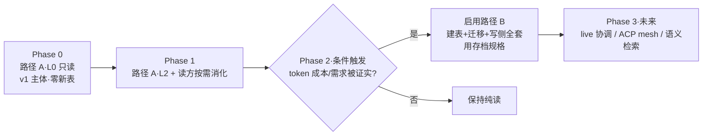

# 多 Agent 协作方向 — 黑板架构 spec（构思版）

> fork: `veniai/hapi` · 工作目录 `/home/claw/projects/hapi` · 分支 `work/current`
> 本文件描述 HAPI 通向多 agent 协作的架构方向（**黑板 / Context Lake**），以及第一步落地功能：**同目录跨 session 上下文感知**。
> 状态：**构思 + 调研 + 拍板 + Codex 走查完成；已确立双路径（A=v1 / B=存档），待实现 Phase 0**。代码尚未改动。
> 调研基准：2026-07。

---

## 0. TL;DR

- **定位**：HAPI 同时包 Claude/Codex/Cursor/Gemini/OpenCode，数据全集中到 hub。**hub 天然就是一块跨 agent、跨机器的共享黑板（Context Lake）——而这块板就是现有的 `messages` 表。** 本方向 = 让新 session 能读到兄弟 session 干了啥。
- **两条路径（均记录在案，§5）**：
  - **路径 A（v1）· 纯读**：新 session 直接读现有 transcript，**读方自己的 LLM 当场消化**。零新表、零迁移、零写侧基建。
  - **路径 B（存档·待验证）· 写侧预消化**：agent 收尾时预先写 digest 到新表 `blackboard_posts`，读方读现成摘要。完整设计保留（§5.2），等 A 证明"预消化值得"再启用。
- **红线（两条，两条路都守）**：
  1. **hub 保持 dumb，绝不碰 LLM**。
  2. **回喂给 agent 的数据一律不可信**（schema 校验 + 大小上限 + 非指令信封 + 只显式下钻）。
- **这不是多 agent 编排**，是编排之前更小的一步——只读的、对历史兄弟 session 的感知。

---

## 1. 背景与痛点

- 同一项目下，新开的 agent session 对**兄弟 session 的工作一无所知**：谁改了哪些文件、踩过什么坑、哪个分支在搞什么。每次都得 re-explain。
- vanilla Claude Code 的 memory 是 **per-machine** 的；社区（issue #27298）求的"同项目跨机器共享"对 HAPI **免费白送**——hub 已经集中存了所有 session 的全量 transcript。
- 数据都在（`messages` 表全量、`metadata.path` 有 cwd），缺的只是**一条把数据变回上下文的通道**。

---

## 2. 调研结论（landscape）

| 系统/概念 | 是什么 | 借 / 不借 |
|---|---|---|
| **OpenClaw "Context Lake"** | shared/persistent/real-time 数据层，agent 在其上推理 | **借定位**：hub 就是 HAPI 的 Context Lake |
| **Hermes（NousResearch）** | 单 agent → 多 agent 编排；episodic memory、ACP 节点 | **借 episodic 口味**；ACP 留到 live 协作阶段 |
| **Mem0** | LLM 抽事实 → 向量库；挂任意 agent | 借"事实抽取"思路，**不借向量库** |
| **Letta (MemGPT)** | 整套 runtime，recall/archival 分层、虚拟分页 | **借分层**（= L0/L1/L2）|
| **Zep / Graphiti** | 时序知识图谱，bi-temporal | **借"会过期"心智**，不借图谱 |
| **黑板架构**（arxiv 2507.01701） | 所有 agent 读写同一中央 shared state，消灭传话衰减 | **核心范式** |
| **RAPTOR**（arxiv 2401.18059） | 递归抽象树，查询可命中任意层 | **借渐进下钻**（读侧） |
| **Karpathy LLM Wiki** | 原始材料 → LLM 编译成互联 wiki；三层渐进披露 | **借分层读取**；与黑板互补（见 §3.1） |
| **Claude Code auto-compact** | context ~95% 自动压；阈值可配 | 借触发式压缩心智；产物当前被 HAPI 丢掉（见 §5.2） |
| **Modulus**（闭源桌面 app） | 跨 agent + 跨 repo 共享项目 memory | 最像的商业产品；非 local-first |

详细来源见 §10。

---

## 3. 核心理念

### 3.1 黑板 vs Wiki —— 两个正交的轴，不是二选一

| | 管什么 | 一句话 |
|---|---|---|
| **黑板** | 内容**怎么来、怎么活着** | 一块多人实时涂写的共享墙 |
| **Wiki** | 内容**怎么省着读**（标题 → 摘要 → 细节，逐层下钻） | 一份文档怎么排得好读 |

- **黑板就是现有的 `messages` 表**——不是新东西。两条路径的分歧只在"摘要（L1）由谁产、存不存"。
- **Wiki 是读法**：L0（便宜列表）→ L1（摘要）→ L2（原始细节），按需下钻。

### 3.2 HAPI 的独特位置

OpenClaw / Hermes / Letta 各自是**一个** agent/系统；Mem0/Zep 是 vendor-neutral 的记忆**工具**，但不是"跑 + 集中多种 agent"的平台。**HAPI 是少有的 agent-agnostic wrapper** + local-first + hub 集中 → 天然就是跨 vendor 的共享黑板。**护城河是那份集中的 transcript——应"利用"它（查询/检索），而非用更不可靠的生产者"复制"一份。** 这是选路径 A 的战略依据。

### 3.3 借什么 / 不借什么

**借**：黑板定位、episodic 内容口味（Mem0/Hermes）、结构化事实抽取（Mem0）、时序/"会过期"心智（Zep）、分层渐进读取（Letta/RAPTOR/Karpathy）、触发式压缩心智（auto-compact）。

**暂不借（留后）**：向量库 / embedding 检索（重资产）；bi-temporal 知识图谱；live shared-write 协调 / ACP mesh。

### 3.4 贯穿红线

1. **hub 保持 dumb：不引入任何 LLM SDK、不持 model key、不做有状态压缩。** 路径 A 天然满足（只查现有数据）；路径 B 由 agent 产 digest（非 hub）。
2. **回喂给 agent 的数据一律不可信。** 无论 A（读兄弟 transcript，里面可能含注入内容）还是 B（agent 自写 post）都成立：版本化 Zod + 大小上限 + **非指令信封**（tool result，非 system prompt）+ **L1/L2 只显式下钻、绝不自动注入**。
3. **namespace 是硬隔离，但只在路由层成立。** 新接口**必须**过 `resolveSessionAccess`（`hub/src/sync/sessionCache.ts:52`）；**绝不**直接调 store 裸 `getSession(id)`（`hub/src/store/sessions.ts:568`，IDOR 陷阱）。
4. **不碰用户的 CLAUDE.md / AGENTS.md**——只动 HAPI 自己注入的 system prompt。
5. **先 Claude 单 flavor 跑通，再铺其他**（路径 B 的覆盖矩阵见 §5.2）。

---

## 4. 总体架构

```
                         ┌─────────────────────────────────────┐
[路径 B·写] agent 完成 chunk│            HUB (dumb)               │   ← v1 不实现
   → hapi__post_board     │   SQLite: blackboard_posts (路径B)  │
   → MCP(CLI) → RPC ─────►│            + sessions/messages(现有)│
                         └──────────────┬──────────────────────┘
                                        │
[路径 A·读 = v1] 新 session (数据不可信) │
   → hapi__sibling_sessions(cwd) ─────►│ → L0: 每 session 标题+首问+状态（单 SQL）
   → hapi__sibling_messages(id,range) ►│ → L2: 原始 transcript 切片
     ↑ 全部过 resolveSessionAccess(namespace)
     ↑ L1 由读方 agent 自己消化 L2，不落库
```

- **v1 只走读侧（路径 A）**：新 session 经 MCP 通道按 cwd 查现有数据，过 `resolveSessionAccess`，按层下钻；返回走 tool result（非指令信封）。
- **写侧（路径 B）存档**：图上半部分，v1 不建。
- **隔离**：namespace 隔离在**路由层**成立；store 层有不带 ns 的 `getSession(id)`，新代码不得使用。

---

## 5. 两条路径（均记录在案）

### 5.0 路径选择

兄弟 session 的数据 HAPI **早就有**（`messages` 全量）。问题天然分两条路，**分歧只在 L1（摘要）由谁产、存不存**：

| | **路径 A：纯读（v1）** | **路径 B：写侧预消化（存档·待验证）** |
|---|---|---|
| "兄弟干了啥"怎么来 | 新 session 读现有 transcript，**读方 LLM 当场消化** | agent 收尾**预写 digest** 到新表，读方读现成摘要 |
| L1（digest） | 读方按需消化 L2，**不落库** | `blackboard_posts.body`，**预存** |
| L0 / L2 | 一样：读现有数据（标题/首问/状态；transcript 切片） | 一样 |
| 新表 / 迁移 | ❌ 不需要 | ✅ `blackboard_posts` + migration 10→11 |
| 写侧基建（Stop hook / 幂等 / 生命周期 / 注入防御 / agent 写可靠性 / 覆盖矩阵） | ❌ 全不需要 | ✅ 全要（§5.2） |
| hub dumb 红线 | ✅ 天然满足 | ✅ digest 由 agent 产 |
| 读方成本 | 每次了解兄弟要花 token 消化原始记录 | 读现成摘要，便宜 |
| 新鲜度 | 永远最新（读 live transcript） | digest 会过期（session 可 resume） |
| 可靠性 | 不依赖 agent 配合 | 依赖 agent 写 + Stop hook + 覆盖矩阵 |
| 注入面 | 兄弟 transcript 里既有的内容 | 新增 agent-authored post（新面） |

**决定（2026-07-18）：v1 走路径 A。** 一个读侧 MCP 工具扒现有数据，零新表零迁移零写侧基建。**路径 B 完整存档（§5.2）**，连同 Codex 走查的 8 条硬约束作为届时现成规格。

**从 A 切到 B 的触发条件**（任一满足即重新评估）：
1. 纯读跑下来，读方消化原始 transcript 的 token 成本被证明确实痛（频繁、量大）；
2. 用户明确想要"预消化摘要"（web 上翻、离线 digest）；
3. 出现"读方消化"无法覆盖的价值（如 agent 自省、跨 session 综合）。

**为何这样选**：核心资产是集中的 transcript；A 是"利用它"，B 是"用更不可靠的生产者复制一份"。v1 用低成本路径先验证痛点真不真、token 贵不贵；B 的全部复杂度只在被真实需要时才付——而那时 §5.2 已是现成规格，不欠设计债。

---

### 5.1 路径 A（v1）· 纯读 + 读方按需消化

| 层 | 内容 | 来源 | 安全 |
|---|---|---|---|
| **L0**（列 sibling 时即给） | 每 session：标题 + 第一条 user msg + 状态 + path | 现有 `metadata`/`messages`，**单 SQL 窗口函数** | 只给标题/首问，不自动展开 |
| **L1**（按需消化） | 读方 agent **自己**拉 L2、自己 LLM 总结 | 读方临时产出，**不落库** | 读方负责；显式触发 |
| **L2**（要细节再取） | 原始 transcript 切片 | 现有 `messages`（分页/范围） | 仅显式请求；首问/内容可能含敏感，截断 |

- **L0 单 SQL**（避免 N+1；现有 `resolveFirstUserMessage` 是 per-session 查 `getFirstMessages`，`hub/src/sync/syncEngine.ts:917`，L0 换成窗口函数一条查）：

  ```sql
  WITH ranked AS (
    SELECT *, ROW_NUMBER() OVER (PARTITION BY id ORDER BY updated_at DESC) AS rn
    FROM sessions WHERE namespace = ? AND json_extract(metadata,'$.path') = ?
  )
  SELECT * FROM ranked WHERE rn = 1 ORDER BY updated_at DESC LIMIT ?;
  -- 首问：单独一次批量取，或 join messages 限 1
  ```

- **MCP 工具**（CLI happy server；**全部过 `resolveSessionAccess` + 按 namespace + path 过滤**）：
  - `hapi__sibling_sessions({ cwd?, limit?, since? })` → L0
  - `hapi__sibling_messages({ sessionId, range })` → L2
  - L1 不需专门工具（读方拉 L2 自总结）；可选 `hapi__sibling_digest({ sessionId })` 让读方明确"帮我消化"，但仍由**读方 LLM** 出、不落库。
- system prompt 加一行指引：「想了解本目录其他 session 干了什么，调 `hapi__sibling_sessions`」。

---

### 5.2 路径 B（存档·待验证）· 写侧预消化摘要

> ⚠️ **本节是存档规格，v1 不实现。** 等 §5.0 触发条件满足再启用。内容（含 Codex 走查的 8 条硬约束）完整保留，作为届时现成设计。

#### Q1：怎么让 agent 主动写？（覆盖矩阵，诚实）

| Flavor | 主路径 | 兜底 | 备注 |
|---|---|---|---|
| **Claude** | system prompt + `hapi__post_board` | **Stop hook**（`decision:block` 提醒） | 唯一有 Stop hook |
| **Codex** | system prompt + `hapi__post_board` | wrapper 收尾**非阻塞**提醒一次 | 自带 lifecycle/compact |
| **Gemini (ACP)** | system prompt + `hapi__post_board` | wrapper 收尾提醒（`runAgentSession.ts:228` finally 加非阻塞 finalize） | ACP 当前无 finalize 钩子 |
| **Cursor / OpenCode** | system prompt + `hapi__post_board` | wrapper 收尾提醒（若有生命周期点） | 无原生 stop 拦截，覆盖最弱 |

- **主路径**（全 flavor）：system prompt 教 agent 在**完成一个有意义的活儿 / 收尾前**调 `hapi__post_board({ headline, body, unit_id })`。复用 `change_title` 那套。
- **兜底**：**只有 Claude 能用 Stop hook**（`generateHookSettings.ts` 现只生成 `SessionStart`，需加 `Stop`；`startHookServer.ts` 现只有 `/hook/session-start`，需加 stop 路由）。其余 flavor 用 wrapper 非阻塞收尾——这才是真正的兜底架构，Claude Stop hook 只是锦上添花。
- **Stop hook 语义**：每 session 持久化"已确认写"标记（按 unit_id）；**最多提醒一次**；hub/RPC 不可用**fail open**；telemetry 记漏写。
- **频率：增量写**，每完成一块写一条；一个 session 在板上是一条**时间线**。

#### Q2：怎么写？看不看以前的内容？

- **对兄弟 session：盲写**（不读别人再写）。重复/矛盾是正常态，去重留给读侧/后续整理。
- **对自己：天然连续**——agent context 里就有它整段对话。例外：被 auto-compact 截断时可用 `hapi__session_thread` 取回自己旧 post 续写（可选）。
- **格式：版本化 Zod schema 的结构化 episodic**（不是散文），有字段/长度/字节上限、必填项、语言策略；conformance fixture 校验：

  ```jsonc
  {
    "headline": "一行（≤200 字符）",                      // required
    "done":     ["…做了的事"],                            // required, ≤20 条, 每条 ≤500
    "episodic": [{"outcome":"win|fail","what":"…","why":"…"}], // 最值钱, ≤20
    "next":     ["…没做完 / 开放问题"],
    "files":    ["…碰过的文件"]
  }
  ```
  **确定性元数据由 CLI 写**（agent 不能瞎编）：`files`、`git_head`、`branch`、`created_at`、`writer_flavor`、`writer_model`、`source_kind`。**agent 只写"解读"**。dumb hub 无法对账真相，故可证伪的客观字段交给 CLI。

#### Q3：写完怎么存？

- **不存成项目里的文档**（wiki-as-file 有并发竞争、污染 repo、不能跨机器）。黑板存在 **hub SQLite**。
- 新表 `blackboard_posts`（已并入安全/幂等/溯源/生命周期）：

  ```sql
  CREATE TABLE IF NOT EXISTS blackboard_posts (
    id              TEXT PRIMARY KEY,
    namespace       TEXT NOT NULL,
    session_id      TEXT NOT NULL,
    unit_id         TEXT NOT NULL,            -- 客户端幂等 key
    path_raw        TEXT NOT NULL,
    path_canonical  TEXT NOT NULL,            -- realpath（v1 聚合 key）
    repo_root       TEXT,
    machine_id      TEXT,
    created_at      INTEGER NOT NULL,
    server_seq      INTEGER NOT NULL,         -- hub 单调序，权威排序
    as_of_seq       INTEGER,                  -- 写时 session seq（staleness）
    writer_flavor   TEXT NOT NULL,            -- 写时快照
    writer_model    TEXT,
    schema_version  INTEGER NOT NULL,
    source_kind     TEXT NOT NULL,            -- self|stop|compact|lazy
    headline        TEXT NOT NULL,
    body            TEXT NOT NULL,            -- JSON，INSERT 前 Zod 校验 + 字节上限
    FOREIGN KEY (session_id) REFERENCES sessions(id) ON DELETE CASCADE,
    UNIQUE (namespace, session_id, unit_id)   -- 幂等：防双写
  );
  CREATE INDEX IF NOT EXISTS idx_bb_path
    ON blackboard_posts(namespace, path_canonical, session_id, created_at DESC);
  CREATE INDEX IF NOT EXISTS idx_bb_recency
    ON blackboard_posts(namespace, path_canonical, created_at DESC);
  ```

- **迁移（关键）**：现有迁移梯（`migrateFromV9ToV10`，`hub/src/store/index.ts:430`）是 **ALTER + PRAGMA table_info 列检查**那套——**建新表不能套**。要用：
  1. `CREATE TABLE IF NOT EXISTS` + `CREATE INDEX IF NOT EXISTS`，**同一事务**；
  2. `buildStepMigrations` 注册 `10: migrateFromV10ToV11`，bump `SCHEMA_VERSION` 10→11；
  3. **加进 `createSchema()`**（`index.ts:149`）——新库走它、跳过梯；
  4. **加进 `REQUIRED_TABLES`**（`index.ts:27`）——否则缺表的 v11 库能过启动校验；
  5. 写 `migration-v11.test.ts`：v10 升级、新库、重复迁移/崩溃、`user_version=0`、required-table 守卫、FK 级联、索引。
- **生命周期**：`FOREIGN KEY ... ON DELETE CASCADE` 让 `deleteSession`（`sessionCache.ts:791`）自动清 post；`mergeSessions`（`sessionCache.ts:814`）**必须迁 post**——在 `mergeSessionData` 显式加一步。
- **path 口径（v1 精确，但记指纹）**：v1 过滤用 `path_canonical`。**已知 false-negative/positive**（明示）：
  - **漏**：`/home/claw/projects/hapi`（源）与 `/home/claw/deploy/hapi`（deploy worktree）canonical 不同 → 拆成俩项目；worktree/symlink/移动目录/容器同理。
  - **撞**：两台机器都用 `/workspace/app` → 误判一个。
  - 即便 v1 过滤不变，**现在就存** `path_raw`/`path_canonical`/`repo_root`/`machine_id`（+ 可选 git remote 指纹），为 v2 归并/重索引留料。
- **"文档"当视图不当存储**：web UI 渲染板视图、或按需导出 markdown。真相在 DB。

> **路径 B 的 (d) 懒算**：原"透明懒算"在 dumb-hub 下不可行，重定义为**请求方 agent 显式触发、自付 token**（`source_kind=lazy` + 源消息范围）；无 agent 在线 = 无 digest。

---

## 6. 决策记录

**顶层决定（2026-07-18）**：**v1 = 路径 A（纯读）；路径 B 完整存档（§5.2），待 §5.0 触发条件启用。**

下表为**路径 B 的设计参数（存档，v1 不实现）**，原 2026-07-17 拍板内容保留：

| # | 岔路 | 决定 | 理由 |
|---|---|---|---|
| 1 | digest 产出方：(a)compact / (b)hub 跑 / (c)agent 自写 / (d)懒算 | **(c) + (a)；(d) 重定义** | (c) 主、(a) 加成；(b) 触红线否；(d) 请求方付费 |
| 2 | "同项目"口径 | **v1 精确 `path_canonical` + 存指纹** | 最简单；false-neg 已记；归并留 v2 |
| 3 | 写频率 | **增量** | 黑板要活、抗崩溃 |
| 4 | Stop hook | **做，只 Claude；其余 wrapper 非阻塞** | 覆盖矩阵见 §5.2 Q1 |
| 5 | 存储 | **新表 `blackboard_posts`** | 跨 session 按 path 聚合 |
| 6 | 复用 `isCompactSummary` | **暂不** | compact 非 episodic；只 Claude 有 |

> 红线（§3.4）、namespace 守卫、幂等是 review 走查后确立的**硬约束**（对两条路生效）。

---

## 7. 对 HAPI 的影响

**路径 A（v1，小）：**

| # | 影响面 | 严重度 | 取舍 |
|---|---|---|---|
| A1 | namespace 守卫纪律 | 🟡 中 | 新接口过 `resolveSessionAccess`；禁 store 裸 `getSession(id)`；授权测试 |
| A2 | L0 N+1 | 🟡 中 | 单条窗口函数 SQL |
| A3 | 每 session token 开销 | 🟠 小 | system prompt 一行 + tool schema |
| A4 | 读方消化 transcript 的 token 成本 | 🟠 小 | L0→L2 下钻控制量；这是切路径 B 的观测项 |

**路径 B（存档，启用时才付）：**

| # | 影响面 | 严重度 | 取舍 |
|---|---|---|---|
| B1 | 信任边界 / 注入防御 | 🔴 大 | Zod+上限、非指令信封、不自动注入、显式下钻 |
| B2 | hub 角色扩张成 LLM 客户端 | 🔴 大 | 仅当选 (b)；(c)/(d) 回避 |
| B3 | 并发/幂等 | 🟡 中 | `UNIQUE(ns,session_id,unit_id)` + unit_id + 单调 seq |
| B4 | schema migration（建表非 ALTER） | 🟡 中 | CREATE IF NOT EXISTS 单事务 + createSchema + REQUIRED_TABLES + v11 测试 |
| B5 | 首次引入 "project" 概念 | 🟡 中 | 隐式（path_canonical）+ 存指纹 |
| B6 | 多 flavor 接线 + 覆盖矩阵 | 🟡 中 | Claude Stop + 其余 wrapper 收尾 |
| B7 | 生命周期（delete/merge） | 🟠 小-中 | FK CASCADE + mergeSessions 迁 post |
| B8 | 动 `isCompactSummary` filter | 🟠 小-中 | 仅当选 (a) |
| B9 | staleness（resume） | 🟠 小 | `as_of_seq` 标版本 |
| B10 | 失败隔离 | 🟠 小 | best-effort + async + fail-open |

---

## 8. 演进路线



- **Phase 0**（v1 主体，零成本）：路径 A 只读 L0——按 `path_canonical` 列 sibling（单 SQL），标题 + 首问 + 状态 + 时间。一个 MCP 工具（过 `resolveSessionAccess`）+ 一行 system prompt。**不动 schema、不写板。**
- **Phase 1**：路径 A 补 L2（transcript 切片）+ 读方按需消化（L1 不落库）。
- **Phase 2（条件触发）**：若 §5.0 触发条件满足 → 启用路径 B（建表 + 迁移 + 写侧全套，用 §5.2 存档规格 + Codex 8 条）。
- **Phase 3（未来，真正多 agent 编排）**：live 写协调、ACP mesh、向量检索、bi-temporal 图谱。

---

## 9. Non-goals（本 spec 明确不做）

- 向量库 / embedding 语义检索（留 Phase 3，或 L0 噪声真撑不住）。
- bi-temporal 知识图谱。
- live 多 agent 写协调 / ACP 通信网格。
- 改用户的 CLAUDE.md / AGENTS.md（只动 HAPI 自己注入的 system prompt）。
- 跨 namespace 共享（隔离是特性，不是缺陷）。
- 完整生命周期（tombstone / supersession / retention）——路径 B 也只做 delete-cascade + merge 迁移。

> **注意**：路径 B（写侧预消化）**不是** non-goal——它是**存档待验证**的替代路径（§5.2），触发条件见 §5.0。

---

## 10. 参考

**黑板 / Context Lake**
- Blackboard for LLM MAS — https://arxiv.org/html/2507.01701v1
- The Blackboard Architecture: Solving the Agent 'Phone Game' — https://rajatpandit.com/agentic-ai/the-blackboard-architecture/
- OpenClaw & the Context Gap（Context Lake） — https://tacnode.io/post/openclaw-and-the-context-gap

**记忆体系对比**
- Agent Memory Architectures: Vector vs Graph vs Episodic — https://www.digitalapplied.com/blog/agent-memory-architectures-vector-graph-episodic
- Zep: State of the Art in Agent Memory — https://blog.getzep.com/state-of-the-art-agent-memory/
- Hermes episodic memory — https://medium.com/@kunwarmahen/the-quiet-shift-in-ai-agents-why-hermes-is-gaining-ground-beyond-openclaw-6364df765d3a
- Hermes multi-agent #344 / shared memory #377 — https://github.com/NousResearch/hermes-agent/issues/344 , /377

**渐进下钻 / 压缩**
- RAPTOR（递归抽象树） — https://arxiv.org/abs/2401.18059
- Karpathy LLM Wiki（gist） — https://gist.github.com/karpathy/442a6bf555914893e9891c11519de94f
- File-based memory（MEMORY.md 索引 + 按需加载） — https://dev.to/whoffagents/how-to-build-persistent-memory-into-claude-code-agents-cross-session-identity-that-actually-works-41h4
- Claude Code auto-compact（cookbook） — https://platform.claude.com/cookbook/tool-use-automatic-context-compaction
- Map-Reduce 长文摘要 — https://cloud.google.com/blog/products/ai-machine-learning/long-document-summarization-with-workflows-and-gemini-models

**同类产品**
- Modulus（共享项目 memory） — https://news.ycombinator.com/item?id=47292101

---

## 附 A：决策时间线

- **2026-07-17**：§6 路径 B 的 6 项设计参数拍板（全选推荐方案）；Codex review 走查（14 条 code claim：12 确认 / 2 部分对 / 0 错），8 条硬约束并入。
- **2026-07-18**：**确立双路径，v1 = 路径 A（纯读）**。起因：退一步审视发现"兄弟数据早已在 `messages`，不必让 agent 重写"；写侧（路径 B）的 90% 复杂度（注入/幂等/迁移/Stop hook/生命周期/可靠性）只源于"要写"这个起点假设。路径 B 完整存档（§5.2），不删，待 §5.0 触发条件启用。

## 附 B：Codex review 走查结论（2026-07-17）

对 Codex 的 14 条带文件行号的代码 claim **逐条独立走查**（读 cited 代码、引原文）：

- **12 CONFIRMED / 2 PARTIAL / 0 REFUTED**，行号基本都准。Codex 这轮没瞎编引用。
- **8 条真问题**（注入防御 / namespace 守卫 / 幂等防双写 / path 身份指纹 + deploy-worktree false-neg / 跨 flavor 覆盖矩阵 / delete-merge 生命周期 / L0 N+1 / migration 建表写法）——**对路径 A 适用的**（namespace 守卫、N+1）已并入 §5.1；**路径 B 专有的**（其余）保留在 §5.2 作其规格。
- **1 条框架修正**：Codex 说"namespace 天然隔离是假的"——**说过头**。路由层 `resolveSessionAccess` 全仓库一致查 namespace，隔离**是设计了**；陷阱只在于"新接口别绕过守卫直接查 store 裸 `getSession(id)`"。
- **未采信（存疑）**：Codex 对比表里标了"unverified"的各系统"缺 X"猜测；"Stop hook 死循环"是 hypothesis（路径 B 已用 fail-open + 最多一次规避）。
