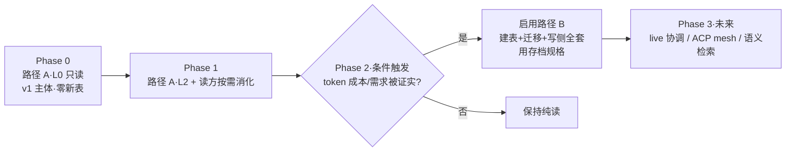

# 多 Agent 协作方向 — 黑板架构 spec（构思版）

> fork: `veniai/hapi` · 工作目录 `/home/claw/projects/hapi` · 分支 `work/current`
> 本文件描述 HAPI 通向多 agent 协作的架构方向（**黑板 / Context Lake**）。**当前权威方向见「决策更新」+「v1.2」**:v1.1 = manager session 做跨 session 记忆检索;v1.2 = manager 主持多 agent 需求讨论→意见稿。下方 §1–§9 是早期「路径 A/B」构思(读层现为 manager 的「眼睛」+ 普通 session 共享,不再当独立 v1 功能)。
> 状态：**构思 + 调研 + 拍板 + Codex 走查完成。方向已收敛（2026-07-18）→ v1 = manager session（v1.1 跨 session 检索 + v1.2 多 agent 讨论→意见稿，见「决策更新」+「v1.2」）；先前「路径 A 纯读当 v1 用户功能」定位作废**。代码尚未改动。
> 调研基准：2026-07。

---

## 0. TL;DR

- **定位**:HAPI 同时包 Claude/Codex/Cursor/Gemini/OpenCode,数据全集中到 hub。**hub 天然就是一块跨 agent、跨机器的共享黑板(Context Lake)——这块板就是现有的 `messages` 表。**
- **当前方向(2026-07-18 收敛,见「决策更新」+「v1.2」)**:v1 载体 = **manager session**(普通 session + `role=manager` + 专属 prompt、只读、按需)。两步:
  - **v1.1 · 跨 session 记忆检索**:用户问「以前解决过 X 吗」→ manager 翻兄弟 transcript 综述答案。
  - **v1.2 · 多 agent 需求讨论→意见稿**:manager spawn 2-3 个(异构)worker **独立答一轮** → 合并成意见稿(一致/争议/开放,带 provenance)。多轮反驳后置。
- **「眼睛」**:读兄弟 session 状态的 MCP 工具 = manager 的感知层,**同时也是普通 session 可调的共享能力**(不加主动 prompt 引导、不押宝普通 session 主动调)。
- **红线(两条)**:① **hub 全程 dumb,绝不碰 LLM**(manager 的 LLM 在 agent 侧);② **回喂数据不可信**(综述非粘贴、数据信封不当指令、能力限制为主边界、带 provenance)。
- **这是编排之前更小的一步**:不是多 agent 编排,是「让一个专职 manager session 感知兄弟 + 主持讨论」。真正编排(派活 / live 协调)留 Phase 3。
- **下文 §1–§9 是早期「路径 A 纯读 / 路径 B 写侧预消化」构思**:路径 A 读工具现降级为 manager 的眼睛(仍建);路径 B 存档不动。凡读到「v1 = 路径 A」处,均以本 TL;DR +「决策更新」为准。

---

## 决策更新（2026-07-18 · 方向收敛）

> 经讨论收敛。先前 §0/§5/§8 把「路径 A 纯读(L0)」当 v1 用户功能交付——**该定位作废**。路径 A 读工具仍建,但定位变了(见下)。**本节是当前权威方向;Codex 走查(2026-07-18)已逐条核实并入 → v1 定稿。**

**新 v1 = manager session,第一刀 = 跨 session 记忆检索(①)。** 把附 C 的 manager 从 Phase 3 **提到 v1**,作为黑板「存储」之上的「控制」载体。依据:价值正从「单 agent 能力」迁向「多 agent 协调」;HAPI 的执行原语(发消息/起 session/事件订阅)大半现成;manager 是把已有资产(transcript + 控制面)变现的结点。

**v1 只做这个,先搭框架:**
1. **跨 session 记忆检索**——用户问「以前解决过 X 吗?」→ manager 翻兄弟 transcript、综述答案。只读、答给人看、低风险。**v1 全部用户价值。**
2. **「眼睛」= manager 感知层,同时是共享 MCP 能力**——同一个读工具,manager 是可靠消费者;**普通 session 也能调**(零额外成本,顺带;只是不押宝普通 session 主动调)。读层照建(原路径 A 的工具),只是不当独立用户功能推,而是 manager 的眼睛 + 普通 session 可选的共享工具。
3. **通知(能力 2)/派活(能力 3)推迟**——当前钉钉够用,智能通知非 v1 卖点(避免造个会误判的过滤层);派活风险高、最易被更强模型原生吃掉,放后。

**manager 定死(Codex 走查已并入,2026-07-18):**
- 普通 session 生命周期 + `metadata.role='manager'` + 专属 system prompt。**底层复用普通 session,但产品角色是专职只读 manager,不当 worker。**
- **默认只读权限 + 最小工具 allowlist**(就 eyes + 回答)。普通 session 默认 `capabilities.terminal=true`(`cli/src/agent/sessionFactory.ts`),manager **必须显式关掉 terminal/edit/网络**——否则被投毒的兄弟 transcript 能诱导它跑命令/改文件(「只答给你看」挡不住,危害在它**自调工具**)。「能当 worker」**移出 v1 承诺**。
- **role 不是免费 metadata 标签**:`MetadataSchema`(`shared/src/schemas.ts:28`)无 role 且 strict 剥未知字段,hub refresh 用它 `safeParse`(`hub/src/sync/sessionCache.ts:124`)→ 光往 JSON 写 `metadata.role` 会被**静默剥掉**。**role 必须进 MetadataSchema + session summary + 创建/恢复链路**,当合同字段。
- **按需,不常驻事件驱动**:你打开 + 问才跑,走普通 session 的 resume/reopen。`sendMessage` 要求 session active(`hub/src/web/routes/messages.ts` `requireActive:true`),进程退出了**不会自动重起**——v1 检索用不着自动唤醒;事件驱动 wake-up 跟通知一起延后。
- **可换框架/模型,但 v1 首选 Claude/Codex**。ACP/Kimi 的 HAPI 指引是**拼进首条 user 消息**(`cli/src/agent/runners/runAgentSession.ts` 的 `SKILL_LOOKUP_INSTRUCTION`),非独立 system/developer 通道,抗注入弱于 Claude/Codex 的 append-system-prompt / developer instructions。「任意框架」= 兼容目标,非 v1 已成立。
- **创建:手动入口**,可选、可暂停、可删。不强行建、不删不掉。一个 workspace 一个(先做 UI 查找/提示,不承诺 metadata 上的强唯一约束)。
- 删 manager 不碰别的 session、不碰 transcript。

**红线 + 安全(Codex 走查已并入):**
- **hub 全程 dumb**:manager 的 LLM 在 manager session(agent 侧),不在 hub;hub 只存数据 + 转发。
- **回喂不可信 + trust 传播防御**:manager 读兄弟 transcript 再讲出 = 内容跨 session 流动,有投毒传播风险。纪律:① **综述而非原样粘贴**;② 当**数据信封**(tool result / 消息上下文)**、不当指令**;③ **安全主边界 = 能力限制**(只读 + allowlist),不只靠 prompt 纪律;④ **回答带 provenance**(出自哪个 session / 时间 / 消息范围,消息已有 `id/seq/createdAt`)+ 显式表达不确定性,别包装成可信事实。
- **namespace-first 查询**:list 类(按 cwd 列兄弟)用 `getSessionsByNamespace`(`hub/src/store/sessions.ts`)+ 从认证主体取 namespace(`hub/src/web/routes/sessions.ts:62`),**不**逐项套 per-id 的 `resolveSessionAccess`(那是 per-session-id 的)。**跨表 join messages 时别漏 namespace**(messages 普遍只按 session_id)——先按 namespace 圈 session、再按 id 读消息;**跨 namespace 同 id/cwd 的越权测试 = v1 门槛**。
- **事件 wake-up 的 user-message 升级风险**(未来才碰):`sendMessage` 固定把输入持久化为 `role:'user'`(`hub/src/sync/messageService.ts:457`);若未来把兄弟内容拼进 wake 消息会获 user 权重、且可能自触发回路。→ 事件唤醒继续留 v1 外;将来用独立结构化内部事件信封,禁转抄 transcript 文本 + 过滤 manager 自身事件 + 去重/预算。

**与原路径 A/B 的关系:**
- 路径 A 读工具(L0/L2)→ **manager 的眼睛**(仍建)+ 普通 session 共享。
- 路径 B(写侧预消化)→ **存档不动**,触发条件不变。
- 路径 A 不再以「Phase 0 纯读独立用户功能」交付。
- 普通 session 共享 eyes **但不加主动 prompt 引导**(Codex):避免又把路径 A 悄悄恢复成独立产品面 + 增加全 flavor 的提示上下文/测试矩阵。

---

## 决策更新（2026-07-21 · 落地核实 + skill 路径修正）

> 状态：CLI/hub 代码走查 + FTS5 实跑完成，**代码尚未改动**。修正 v1.1 落地路径，记录 `acfc8a8`（2026-07-20）对 v1.2 的影响。**待 Codex 复审**（重点见末）。

### A. acfc8a8 与 v1.2 worker 候选集（经走查修正）

`acfc8a8`（2026-07-20）移除"往 remote agent 首条 user 消息 prepend `SKILL_LOOKUP_INSTRUCTION`"——Cursor ACP 把这段当 prompt injection 拦了。

**经走查（Codex 点 4）：acfc8a8 只证明"偷偷 prepend discovery 指令"有问题，不证明"worker 正常任务消息不能写成讨论者指令"**——后者本就是 user task，不是夹带 discovery。现状：`runAgentSession.ts:183` 现只发 `batch.message`；ACP `session/new` 只传 `cwd`+`mcpServers`、无 system 字段（`AcpSdkBackend.ts:284`）。

**修正后的 worker 选型（不靠 acfc8a8 推导）**：取决两个独立条件——① 正常首条任务能否稳定遵循 panel 格式；② runner 能否**机械限制工具/写权限**。**只读安全不能靠 system prompt**——无真实 capability 强制，Claude/Codex 同样不安全。Claude/Codex 作 v1.2 **首发**（已有可控专属通道：`--append-system-prompt` / developer_instructions），理由是"通道可控可测"而非"acfc8a8 禁了 Kimi"。Kimi/Cursor 标"暂未验证/暂不首发"，不是"不能接"。原"优先异构（Claude+Kimi）"作废（v1.2 节旧句同步标记失效，见下）。

### B. 搜索 #3 落地核实（FTS5 实跑 · 方案已修正）

bun:sqlite 支持 FTS5（SQLite 3.53.0）。**经 Codex 复审 + 实跑裁决（`/tmp/hapi-blobs/fts5-probe.ts`，7 项）：之前"触发器不可用、必须 contentless + 应用层双写"的结论错了。** 实跑证明：
- ✅ **external-content FTS5（`content='messages', content_rowid='id'`）+ 标准 AFTER INSERT/UPDATE/DELETE trigger 全通**（最干净，自动同步 + 天然事务原子）；
- ✅ external-content 可 `rebuild`（清理悬挂 rowid）；
- ❌ contentless（`content=''`）普通 DELETE 报错（需 `contentless_delete=1`）、且不能 rebuild。

**修正方案 = external-content FTS5 + 标准 trigger**（弃用应用层手动双写）：建 `messages_fts USING fts5(body, content='messages', content_rowid='id')` + 3 个 trigger 自动同步；现有 `addMessage`/`copyMessage` 无需改（trigger 拦截）；删 session 的悬挂 rowid 靠 trigger 或定期 `rebuild` 清。**trigger 同步天然原子**（同事务），比应用层双写可靠（后者 `addMessage`/`copyMessage` 无事务包裹，单边提交风险——Codex 点 2）。

- `messages.content` 是 JSON 字符串；namespace 要 JOIN sessions；path 在 `sessions.metadata`（`json_extract`）。
- 落地：SCHEMA_VERSION 13→14，external-content FTS5 表 + INSERT/UPDATE/DELETE trigger；body 从 content JSON 提取（各 flavor 格式不同，**需明确确定性解析合同**——不违反 dumb-hub 红线，但要协调"各 flavor 格式"与"trigger 里的 SQL 提取"）。
- **待拍**：① 同项目 path 归一化（worktree 子目录现算两个项目）；② body 范围；③ UPDATE trigger 的 body 重提成本。
- memory `fts5-app-layer-doublewrite` 已证伪，改为 external-content 方案。

### C. skill 机制 + 三条路（C 降级，manager 走 A 窄版为主 · 走查修正）

**核实**：HAPI 注入 Claude 的 system prompt 只有 change_title/display_image/commit，**无 skill 列表**；`skill_lookup` 是 `$名字` 显式触发；`listSkills` 给 web/HTTP 不进 agent prompt。HAPI 跑 Claude = 标准 CLI + `--append-system-prompt`（追加不覆盖）+ `--settings` 只配 SessionStart hook、没禁 skill → Claude 原生 skill 机制层面未禁（但"会自主激活"❓ 未实测）。

**经走查（Codex 点 1）：C 不作 v1.1 主路径。** skill 放宿机（含 `~/.agents/skills/`、`~/.claude/skills/`）= machine-local 隐式状态，破坏 HAPI"跨机器、远程控制"语义：版本/存在性/启停跨机器不一致；namespace 只路由隔离、不分发宿机文件；web 只能列不能管（编辑 skill = 远程写文件，要路径约束/防 symlink/权限/审计，非简单 CRUD）。

**v1.1 主路径 = manager 走 A 窄版**：不做全局 skill 列表注入，把"何时搜兄弟、如何处理不可信结果"写进 **manager 已必需的专属 system/developer prompt**（Claude/Codex 都有干净通道）。manager session 由 hub/runner 起、prompt 跟 session 走 → 天然跨机器 + web 可管（manager 是 session）。

**C 路径（降为可选增强）**：普通 Claude session 的"查兄弟"可做 skill 放**项目级 `.agents/skills/`**（flavor 中立，Claude/Cortex 都扫；借 Git 分发覆盖受控 repo）——回应"跟 Cortex skill 放一起"：`.agents/skills/` 确实是 flavor 中立目录、比 `~/.claude/skills` 更通用，但仅覆盖受控 repo、不覆盖任意远程目录、也不解决 web 启停。作实验性增强，非 v1.1 合同能力。

注：A 也不是"天然跨机器"——prompt 编译在 CLI 仍依赖每台机器升级 CLI；真正中心化要把配置存 hub 随 spawn/RPC 下发（远期）。

### D. manager 落地核实（capability/spawn 能力被高估 · 走查修正）

- **role 进 schema**：`MetadataSchema`（`shared/src/schemas.ts:28`）是普通 `z.object`、**无 `.strict()`**——Zod **默认 strip unknown keys**（不是 strict 拒绝）。带未知 `role` 的对象 safeParse 成功但 `role` 被剥（`sessionCache.ts:123/1111` 用 parsed.data）。→ **必须显式加 `role: z.enum(['manager']).optional()`**；别用 `.passthrough()`（弱化合同）。只改 schema 不够：创建/恢复/summary/序列化/CLI 整对象更新都要逐条验证，防旧 CLI 覆盖丢 role。
- **权限收窄（能力高估修正）**：`SessionCapabilitiesSchema`（`schemas.ts:14`）**只有 `terminal?: boolean`**——没有 edit/bash/MCP allowlist 的统一强制层。manager"关 terminal"能做，但"关 edit/bash、只留 allowlist"**现有 schema 不支持，要新增强制层**（不能靠 system prompt——Codex 点 4）。
- **spawn worker（v1.2）**：`/spawn-session` 路由只透传 directory/sessionId/sessionType/worktreeName；底层 `SpawnSessionOptions`（`rpcTypes.ts`）支持 agent/model/permissionMode/yolo，**但没有工具白名单字段（待新增合同）**。worker 只读安全靠 capability 强制，不靠 spawn 透传 system prompt。
- **派活注入**：Claude `--append-system-prompt`、Codex developer_instructions 干净；**角色/输出格式可走正常 user task**（不必塞 system）；权限走 capability 强制；只有持久策略/不可信边界走 system/developer。三者分别建模。

### v1.1 修正图景（走查后）

- **搜索工具（#3）**：HAPI 提供（hub external-content FTS5 + trigger + MCP 工具）。
- **"查兄弟"主路径**：写进 **manager 专属 system/developer prompt**（A 窄版），跨机器 + web 可管。
- **可选增强**：项目级 `.agents/skills/` skill（Git 分发，仅受控 repo + Claude；可跟 Cortex skill 同目录）。
- **manager 综述**：`role=manager` 专职只读 session（capability 强制收窄，需扩 schema），用搜索工具做综述。

**Codex 复审已并入**（点 1-4 + 其他，几乎全对，逐条实跑/读码核实）。**待办**：① FTS5 external-content + trigger 的 migration；② capability 强制层扩 edit/bash/allowlist；③ `role` 进 schema + 全链路验证；④ worker spawn 的工具白名单合同。

---

## v1.2 · 多 agent 需求讨论(manager 主持 → 意见稿)

> 状态:**调研背书(deep-research)+ Codex 两轮走查已并入;代码尚未改动。** v1.1 之后第二步。**第一版收成「独立单轮 panel + 单次合并」**(用户拍板 2026-07-18);多轮反驳、`relay_message` 后置。manager 第一个「有界 actuation」= `spawn_worker`(第一版**只需这一个**新工具;`relay_message` 随多轮后置),仍不碰文件。

**定位(最重要,被调研修正过)**:这功能的价值是**多元视角 + 显式分歧地图 + 一份供人拍板的审议产物**,而**不是**「比单个强模型给出更对的答案」。调研最强的结论:**默认多 agent 辩论并不 reliably 打过 单 agent + 强 prompt / self-consistency**(Smit ICML 2024;Du 2023「提升事实性/推理」claim 被对抗投票 **refuted 0-3**)。所以**别按「更聪明」卖**,按「视角更广 + 把分歧摊给你」卖——对**需求/设计这种没有唯一正解**的审议场景,这才真有用。

**协议(第一版 = 独立单轮 + 单次合并;用户拍板 2026-07-18)**:
1. 你给需求 + 选 2-3 个参与者(~~**优先不同框架**——Claude + Kimi~~;同模型两份 = echo chamber)。> ⚠️ **参与者候选集已修正（见「决策更新（2026-07-21）」A 节）：首发 Claude+Codex（可控专属通道），Kimi/Cursor 标"暂未验证"非"不能接"；原"Claude+Kimi"作废。**
2. manager **spawn** 它们为 worker session(需新建 `spawn_worker` MCP 工具,见「能力分档」;worker = **只读讨论者**,见下「Codex 并入」)。
3. **各 worker 独立出立场、互不可见**(避锚定)——这是第一版的**全部**交互。
4. manager 用 eyes 收齐各 worker 答案 → **单次合并**出**意见稿 = {一致项 / 争议项(双/多方并列)/ 开放问题}**,带 provenance。**显式留分歧,绝不强行假一致。** 完。

> **后置(不在第一版)**:多轮反驳(`relay_message` 让 worker 看对方摘要 + 修订 + 自适应停)。仅当第一版跑通、且 manager 真能挑出「某分歧会改结论」时,再做成「可选定向反驳一轮」。多轮会带回 relay 注入面、循环状态、早停判断和大半成本——第一版**不承担**这些。

**必须守的调研反模式(每条有出处)**:
- **manager 自己是 sycophancy 面,不是解药**(Yao arXiv:2509.23055):judge-driven 崩塌是**独立**失效模式 → manager 的合并**可审计**(provenance)、**残存分歧显式上墙**、不许静默「达成共识」。
- **长辩论退化**(Tran arXiv:2501.06322):coherence/relevance 随轮数掉 + 成本爆炸 → 硬轮数上限 + 早停 + 预算墙。
- **dense 拓扑 echo-chamber / 退化到最差答案**(Li EMNLP 2024):难题下「看越多越错」→ star/稀疏(manager 居中转发摘要,不 all-to-all 原文)。
- **幻觉传播放大**(Tran §6):一个 agent 的幻觉被同伴 reinforce → manager **批判性综合**(不把 worker 的话当事实 relay)+ provenance + 标不确定。
- **跨 vendor 多样性 = 有条件收益,非万能解药**(Li EMNLP 2024;arXiv:2502.08788「universal antidote」claim **refuted 0-2**):异构只在「强模型放高中心度节点」时略好(~1.2pp、单任务、证据窄)→ 选不同框架是为**视角多样性**,不是为正确率。**judge/manager 用什么模型是开放问题**(调研自列开放;「强模型放高中心度节点」是针对 debater/worker、窄证据,**不能**直接推出 judge 宜强)——落地实测,别预设宜强。
- **锚定**:第 0 轮互不可见(已进协议)。

**能力分档(承接 v1.1)**:

| 档 | manager 干啥 | v1 |
|---|---|---|
| 感知(eyes) | 读兄弟 transcript | v1.1 检索 |
| **有界 actuation** | `spawn_worker`(**第一版仅此一个**新工具,封顶) | **v1.2 辩论(第一版)** |
| 文件改动(edit/bash) | —— | **永不给 manager** |

> **第一版没有 worker↔worker relay**(各自独立答、互不见)→ Codex 担心的「relay 把内容当 user 指令注入下一个 worker」**在第一版不存在**(随多轮反驳后置)。manager 只 spawn + 读(eyes)+ 合并。relay 相关的 trust 问题(「manager 综合非主要防线」「relay 被当 `role:'user'`」)留到多轮那一档再啃。

**诚实 caveat(research 明示)**:
- **领域错配**:几乎所有证据都是数学/事实 QA(GSM8K / trivia / harmlessness);**没有任何研究验证过辩论对「设计审议 / 立场文档」有效**。 → HAPI 这功能是**审议辅助(摊视角 + 摊分歧),不是正确性引擎**;已知坑(sycophancy / echo / 成本 / 打不过 baseline)对设计任务**只会更严重**(a fortiori)。
- **manager 模型选择未定**:judge-driven sycophancy 跟 manager 用什么模型强相关,但研究没钉死「强 / 弱 / 异构 judge 谁更稳」——开放问题,落地要实测。

**Done 条件(第一版,待实现时补机械项)**:
- 起 2-3 个(可异构框架)**只读讨论者** worker、**各自独立答一轮(互不见)**、manager 合并出带 provenance 的意见稿(一致 / 争议 / 开放三段)、残存分歧显式上墙。
- **出意外给残缺意见稿**:worker 掉线 / 超时 / 预算耗尽 → 仍产出意见稿,标清「谁没答、为啥停」,用户决定补不补一轮(Codex 并入)。
- 成本:`spawn_worker` 有预算上限(防被诱导无限 spawn 烧钱——Codex)。
- 安全:manager **和** worker 都**不碰文件**(worker 也是只读讨论者)、worker 限定在本 debate 的获准集合 + 当前 workspace(Codex:单 namespace 不够细,要绑 debate / worker IDs)。
- 一次性:第一版是**点一下 → 等结果 → 完事**,不做可恢复 / 可取消(Codex 的 one-shot vs resumable——先简单)。
- 手测:同一需求跑「单 agent 强 prompt」 vs 「2 异构 agent 独立答 + 合并」对比意见稿质量(research 要求的 baseline 对比)。

**Codex 走查功能性并入(2026-07-18,两轮)**:① worker 也是**只读讨论者**(普通 session 默认 `terminal:true`,被注入仍能改文件 → 必须锁);② 出意外给**残缺意见稿**而非静默失败;③ **一次性**(非可恢复,先简单);④ 意见稿 = manager 的**一条消息**(不新建表);⑤ provenance 必须**系统校验**(manager 可能编造引用 → 引用要能点回真消息);⑥ `spawn_worker` 不透传 `yolo`/`permissionMode`/任意 model(被注入的 manager 可借此起高权限 worker)。
**技术 deferred(实现时再啃)**:服务端硬预算怎么落、debate run 状态怎么存(若将来要做可恢复)、namespace 粒度细化、relay 的 `role:'user'` 升权问题(随多轮)。

**调研背书(2026-07-18 deep-research,verified)**:
- Du et al. ICML 2024 — MAD 基线(固定轮、对称、无 manager / 无投票)— https://arxiv.org/abs/2305.14325
- Tran et al. 2025 survey — judge-mediated、长辩论退化、幻觉传播 — https://arxiv.org/abs/2501.06322
- Yao et al. 2025 — sycophancy 使辩论更差、debater / judge 双崩塌 — https://arxiv.org/abs/2509.23055
- Li et al. EMNLP 2024 — sparse 拓扑、echo-chamber、异构条件性 — https://aclanthology.org/2024.findings-emnlp.427.pdf
- Smit et al. ICML 2024 — 默认 MAD 打不过 self-consistency / 强 prompt baseline — https://proceedings.mlr.press/v235/smit24a.html
- AutoGen MAD 官方模式 — solver + 非 LLM aggregator + 多数投票 + sparse — https://microsoft.github.io/autogen/stable/user-guide/core-user-guide/design-patterns/multi-agent-debate.html
- 完整报告 + 4 条 refuted / 6 条 unverified / 22 条来源清单:归档于 **`doc/research/multi-agent-debate-2026-07.md`**(原始 JSON 曾在 `/tmp/.../w3mns61vy.output`,易失)。

---

## 1. 背景与痛点

- 同一项目下，新开的 agent session 对**兄弟 session 的工作一无所知**：谁改了哪些文件、踩过什么坑、哪个分支在搞什么。每次都得 re-explain。
- vanilla Claude Code 的 memory 是 **per-machine** 的；社区（issue #27298）求的"同项目跨机器共享"对 HAPI **免费白送**——hub 已经集中存了所有 session 的全量 transcript。
- 数据都在（`messages` 表全量、`metadata.path` 有 cwd），缺的只是**一条把数据变回上下文的通道**。

---

## 2. 调研结论（landscape）

| 系统/概念 | 是什么 | 借 / 不借 |
|---|---|---|
| **OpenClaw "Context Lake"** | shared/persistent/real-time 数据层，agent 在其上推理 | **借定位**：hub 就是 HAPI 的 Context Lake |
| **Hermes（NousResearch）** | 单 agent → 多 agent 编排；episodic memory、ACP 节点 | **借 episodic 口味**；ACP 留到 live 协作阶段 |
| **Mem0** | LLM 抽事实 → 向量库；挂任意 agent | 借"事实抽取"思路，**不借向量库** |
| **Letta (MemGPT)** | 整套 runtime，recall/archival 分层、虚拟分页 | **借分层**（= L0/L1/L2）|
| **Zep / Graphiti** | 时序知识图谱，bi-temporal | **借"会过期"心智**，不借图谱 |
| **黑板架构**（arxiv 2507.01701） | 所有 agent 读写同一中央 shared state，消灭传话衰减 | **核心范式** |
| **RAPTOR**（arxiv 2401.18059） | 递归抽象树，查询可命中任意层 | **借渐进下钻**（读侧） |
| **Karpathy LLM Wiki** | 原始材料 → LLM 编译成互联 wiki；三层渐进披露 | **借分层读取**；与黑板互补（见 §3.1） |
| **Claude Code auto-compact** | context ~95% 自动压；阈值可配 | 借触发式压缩心智；产物当前被 HAPI 丢掉（见 §5.2） |
| **Modulus**（闭源桌面 app） | 跨 agent + 跨 repo 共享项目 memory | 最像的商业产品；非 local-first |

详细来源见 §10。

---

## 3. 核心理念

### 3.1 黑板 vs Wiki —— 两个正交的轴，不是二选一

| | 管什么 | 一句话 |
|---|---|---|
| **黑板** | 内容**怎么来、怎么活着** | 一块多人实时涂写的共享墙 |
| **Wiki** | 内容**怎么省着读**（标题 → 摘要 → 细节，逐层下钻） | 一份文档怎么排得好读 |

- **黑板就是现有的 `messages` 表**——不是新东西。两条路径的分歧只在"摘要（L1）由谁产、存不存"。
- **Wiki 是读法**：L0（便宜列表）→ L1（摘要）→ L2（原始细节），按需下钻。

### 3.2 HAPI 的独特位置

OpenClaw / Hermes / Letta 各自是**一个** agent/系统；Mem0/Zep 是 vendor-neutral 的记忆**工具**，但不是"跑 + 集中多种 agent"的平台。**HAPI 是少有的 agent-agnostic wrapper** + local-first + hub 集中 → 天然就是跨 vendor 的共享黑板。**护城河是那份集中的 transcript——应"利用"它（查询/检索），而非用更不可靠的生产者"复制"一份。** 这是选路径 A 的战略依据。

### 3.3 借什么 / 不借什么

**借**：黑板定位、episodic 内容口味（Mem0/Hermes）、结构化事实抽取（Mem0）、时序/"会过期"心智（Zep）、分层渐进读取（Letta/RAPTOR/Karpathy）、触发式压缩心智（auto-compact）。

**暂不借（留后）**：向量库 / embedding 检索（重资产）；bi-temporal 知识图谱；live shared-write 协调 / ACP mesh。

### 3.4 贯穿红线

1. **hub 保持 dumb：不引入任何 LLM SDK、不持 model key、不做有状态压缩。** 路径 A 天然满足（只查现有数据）；路径 B 由 agent 产 digest（非 hub）。
2. **回喂给 agent 的数据一律不可信。** 无论 A（读兄弟 transcript，里面可能含注入内容）还是 B（agent 自写 post）都成立：版本化 Zod + 大小上限 + **非指令信封**（tool result，非 system prompt）+ **L1/L2 只显式下钻、绝不自动注入**。
3. **namespace 是硬隔离,但只在路由层成立。** 按 **ID** 读走 `resolveSessionAccess`(`hub/src/sync/sessionCache.ts:52`);**list / 集合**查询走 namespace-scoped(`getSessionsByNamespace` + 从认证主体取 namespace——见决策更新「namespace-first」)。**绝不**直接调 store 裸 `getSession(id)`(`hub/src/store/sessions.ts:568`,IDOR 陷阱)。
4. **不碰用户的 CLAUDE.md / AGENTS.md**——只动 HAPI 自己注入的 system prompt。
5. **先 Claude 单 flavor 跑通，再铺其他**（路径 B 的覆盖矩阵见 §5.2）。

---

## 4. 总体架构

> ⚠️ **方向已收敛(见「决策更新」)**:图里的「路径 A·读 = v1」现降级为 **manager 的「眼睛」+ 普通 session 共享**;v1 载体是 **manager session**,不是「路径 A 当独立 v1 功能」。下图保留作读层 substrate 参考。

```
                         ┌─────────────────────────────────────┐
[路径 B·写] agent 完成 chunk│            HUB (dumb)               │   ← v1 不实现
   → hapi__post_board     │   SQLite: blackboard_posts (路径B)  │
   → MCP(CLI) → RPC ─────►│            + sessions/messages(现有)│
                         └──────────────┬──────────────────────┘
                                        │
[路径 A·读 = v1] 新 session (数据不可信) │
   → hapi__sibling_sessions(cwd) ─────►│ → L0: 每 session 标题+首问+状态（单 SQL）
   → hapi__sibling_messages(id,range) ►│ → L2: 原始 transcript 切片
     ↑ 全部过 resolveSessionAccess(namespace)
     ↑ L1 由读方 agent 自己消化 L2，不落库
```

- **v1 只走读侧（路径 A）**：新 session 经 MCP 通道按 cwd 查现有数据，过 `resolveSessionAccess`，按层下钻；返回走 tool result（非指令信封）。
- **写侧（路径 B）存档**：图上半部分，v1 不建。
- **隔离**：namespace 隔离在**路由层**成立；store 层有不带 ns 的 `getSession(id)`，新代码不得使用。

---

## 5. 两条路径（均记录在案）

### 5.0 路径选择

兄弟 session 的数据 HAPI **早就有**（`messages` 全量）。问题天然分两条路，**分歧只在 L1（摘要）由谁产、存不存**：

| | **路径 A:纯读(manager 的眼睛·共享)** | **路径 B:写侧预消化(存档·待验证)** |
|---|---|---|
| "兄弟干了啥"怎么来 | 新 session 读现有 transcript，**读方 LLM 当场消化** | agent 收尾**预写 digest** 到新表，读方读现成摘要 |
| L1（digest） | 读方按需消化 L2，**不落库** | `blackboard_posts.body`，**预存** |
| L0 / L2 | 一样：读现有数据（标题/首问/状态；transcript 切片） | 一样 |
| 新表 / 迁移 | ❌ 不需要 | ✅ `blackboard_posts` + migration 10→11 |
| 写侧基建（Stop hook / 幂等 / 生命周期 / 注入防御 / agent 写可靠性 / 覆盖矩阵） | ❌ 全不需要 | ✅ 全要（§5.2） |
| hub dumb 红线 | ✅ 天然满足 | ✅ digest 由 agent 产 |
| 读方成本 | 每次了解兄弟要花 token 消化原始记录 | 读现成摘要，便宜 |
| 新鲜度 | 永远最新（读 live transcript） | digest 会过期（session 可 resume） |
| 可靠性 | 不依赖 agent 配合 | 依赖 agent 写 + Stop hook + 覆盖矩阵 |
| 注入面 | 兄弟 transcript 里既有的内容 | 新增 agent-authored post（新面） |

**决定（2026-07-18）：v1 走路径 A。** 一个读侧 MCP 工具扒现有数据，零新表零迁移零写侧基建。**路径 B 完整存档（§5.2）**，连同 Codex 走查的 8 条硬约束作为届时现成规格。

> ⚠️ **方向调整（2026-07-18 续，见「决策更新」）**：路径 A 读工具仍建，但降级为 **manager 的感知层 + 普通 session 共享工具**，不再当 v1 独立用户功能交付。v1 载体改为 manager session。

**从 A 切到 B 的触发条件**（任一满足即重新评估）：
1. 纯读跑下来，读方消化原始 transcript 的 token 成本被证明确实痛（频繁、量大）；
2. 用户明确想要"预消化摘要"（web 上翻、离线 digest）；
3. 出现"读方消化"无法覆盖的价值（如 agent 自省、跨 session 综合）。

**为何这样选**：核心资产是集中的 transcript；A 是"利用它"，B 是"用更不可靠的生产者复制一份"。v1 用低成本路径先验证痛点真不真、token 贵不贵；B 的全部复杂度只在被真实需要时才付——而那时 §5.2 已是现成规格，不欠设计债。

---

### 5.1 路径 A · 纯读 + 读方按需消化（= manager 的眼睛；见「决策更新」）

| 层 | 内容 | 来源 | 安全 |
|---|---|---|---|
| **L0**（列 sibling 时即给） | 每 session：标题 + 第一条 user msg + 状态 + path | 现有 `metadata`/`messages`，**单 SQL 窗口函数** | 只给标题/首问，不自动展开 |
| **L1**（按需消化） | 读方 agent **自己**拉 L2、自己 LLM 总结 | 读方临时产出，**不落库** | 读方负责；显式触发 |
| **L2**（要细节再取） | 原始 transcript 切片 | 现有 `messages`（分页/范围） | 仅显式请求；首问/内容可能含敏感，截断 |

- **L0 单 SQL**（避免 N+1；现有 `resolveFirstUserMessage` 是 per-session 查 `getFirstMessages`，`hub/src/sync/syncEngine.ts:917`，L0 换成窗口函数一条查）：

  ```sql
  WITH ranked AS (
    SELECT *, ROW_NUMBER() OVER (PARTITION BY id ORDER BY updated_at DESC) AS rn
    FROM sessions WHERE namespace = ? AND json_extract(metadata,'$.path') = ?
  )
  SELECT * FROM ranked WHERE rn = 1 ORDER BY updated_at DESC LIMIT ?;
  -- 首问：单独一次批量取，或 join messages 限 1
  ```

  > ⚠️ **此 SQL 有 bug(走查发现)**:`PARTITION BY id` 在 `sessions` 表(每 session 一行)上是**空操作**。窗口函数应改用在 **`messages`** 上(`PARTITION BY session_id ORDER BY seq ASC` 取首条 user msg);sessions 侧直接 `WHERE namespace + path ORDER BY updated_at DESC LIMIT ?` 即可。实现时修正。

- **MCP 工具**(CLI happy server;**按 namespace-scoped 查询 + path 过滤**——list 类**不**套 per-id 的 `resolveSessionAccess`,见决策更新「namespace-first」):
  - `hapi__sibling_sessions({ cwd?, limit?, since? })` → L0
  - `hapi__sibling_messages({ sessionId, range })` → L2
  - L1 不需专门工具（读方拉 L2 自总结）；可选 `hapi__sibling_digest({ sessionId })` 让读方明确"帮我消化"，但仍由**读方 LLM** 出、不落库。
- system prompt:**只给 manager** 加指引;**普通 session 不加主动 prompt 引导**(见决策更新——避免又把路径 A 恢复成独立产品面 + 增加全 flavor 提示上下文)。

---

### 5.2 路径 B（存档·待验证）· 写侧预消化摘要

> ⚠️ **本节是存档规格，v1 不实现。** 等 §5.0 触发条件满足再启用。内容（含 Codex 走查的 8 条硬约束）完整保留，作为届时现成设计。

#### Q1：怎么让 agent 主动写？（覆盖矩阵，诚实）

| Flavor | 主路径 | 兜底 | 备注 |
|---|---|---|---|
| **Claude** | system prompt + `hapi__post_board` | **Stop hook**（`decision:block` 提醒） | 唯一有 Stop hook |
| **Codex** | system prompt + `hapi__post_board` | wrapper 收尾**非阻塞**提醒一次 | 自带 lifecycle/compact |
| **Gemini (ACP)** | system prompt + `hapi__post_board` | wrapper 收尾提醒（`runAgentSession.ts:228` finally 加非阻塞 finalize） | ACP 当前无 finalize 钩子 |
| **Cursor / OpenCode** | system prompt + `hapi__post_board` | wrapper 收尾提醒（若有生命周期点） | 无原生 stop 拦截，覆盖最弱 |

- **主路径**（全 flavor）：system prompt 教 agent 在**完成一个有意义的活儿 / 收尾前**调 `hapi__post_board({ headline, body, unit_id })`。复用 `change_title` 那套。
- **兜底**：**只有 Claude 能用 Stop hook**（`generateHookSettings.ts` 现只生成 `SessionStart`，需加 `Stop`；`startHookServer.ts` 现只有 `/hook/session-start`，需加 stop 路由）。其余 flavor 用 wrapper 非阻塞收尾——这才是真正的兜底架构，Claude Stop hook 只是锦上添花。
- **Stop hook 语义**：每 session 持久化"已确认写"标记（按 unit_id）；**最多提醒一次**；hub/RPC 不可用**fail open**；telemetry 记漏写。
- **频率：增量写**，每完成一块写一条；一个 session 在板上是一条**时间线**。

#### Q2：怎么写？看不看以前的内容？

- **对兄弟 session：盲写**（不读别人再写）。重复/矛盾是正常态，去重留给读侧/后续整理。
- **对自己：天然连续**——agent context 里就有它整段对话。例外：被 auto-compact 截断时可用 `hapi__session_thread` 取回自己旧 post 续写（可选）。
- **格式：版本化 Zod schema 的结构化 episodic**（不是散文），有字段/长度/字节上限、必填项、语言策略；conformance fixture 校验：

  ```jsonc
  {
    "headline": "一行（≤200 字符）",                      // required
    "done":     ["…做了的事"],                            // required, ≤20 条, 每条 ≤500
    "episodic": [{"outcome":"win|fail","what":"…","why":"…"}], // 最值钱, ≤20
    "next":     ["…没做完 / 开放问题"],
    "files":    ["…碰过的文件"]
  }
  ```
  **确定性元数据由 CLI 写**（agent 不能瞎编）：`files`、`git_head`、`branch`、`created_at`、`writer_flavor`、`writer_model`、`source_kind`。**agent 只写"解读"**。dumb hub 无法对账真相，故可证伪的客观字段交给 CLI。

#### Q3：写完怎么存？

- **不存成项目里的文档**（wiki-as-file 有并发竞争、污染 repo、不能跨机器）。黑板存在 **hub SQLite**。
- 新表 `blackboard_posts`（已并入安全/幂等/溯源/生命周期）：

  ```sql
  CREATE TABLE IF NOT EXISTS blackboard_posts (
    id              TEXT PRIMARY KEY,
    namespace       TEXT NOT NULL,
    session_id      TEXT NOT NULL,
    unit_id         TEXT NOT NULL,            -- 客户端幂等 key
    path_raw        TEXT NOT NULL,
    path_canonical  TEXT NOT NULL,            -- realpath（v1 聚合 key）
    repo_root       TEXT,
    machine_id      TEXT,
    created_at      INTEGER NOT NULL,
    server_seq      INTEGER NOT NULL,         -- hub 单调序，权威排序
    as_of_seq       INTEGER,                  -- 写时 session seq（staleness）
    writer_flavor   TEXT NOT NULL,            -- 写时快照
    writer_model    TEXT,
    schema_version  INTEGER NOT NULL,
    source_kind     TEXT NOT NULL,            -- self|stop|compact|lazy
    headline        TEXT NOT NULL,
    body            TEXT NOT NULL,            -- JSON，INSERT 前 Zod 校验 + 字节上限
    FOREIGN KEY (session_id) REFERENCES sessions(id) ON DELETE CASCADE,
    UNIQUE (namespace, session_id, unit_id)   -- 幂等：防双写
  );
  CREATE INDEX IF NOT EXISTS idx_bb_path
    ON blackboard_posts(namespace, path_canonical, session_id, created_at DESC);
  CREATE INDEX IF NOT EXISTS idx_bb_recency
    ON blackboard_posts(namespace, path_canonical, created_at DESC);
  ```

- **迁移（关键）**：现有迁移梯（`migrateFromV9ToV10`，`hub/src/store/index.ts:430`）是 **ALTER + PRAGMA table_info 列检查**那套——**建新表不能套**。要用：
  1. `CREATE TABLE IF NOT EXISTS` + `CREATE INDEX IF NOT EXISTS`，**同一事务**；
  2. `buildStepMigrations` 注册 `10: migrateFromV10ToV11`，bump `SCHEMA_VERSION` 10→11；
  3. **加进 `createSchema()`**（`index.ts:149`）——新库走它、跳过梯；
  4. **加进 `REQUIRED_TABLES`**（`index.ts:27`）——否则缺表的 v11 库能过启动校验；
  5. 写 `migration-v11.test.ts`：v10 升级、新库、重复迁移/崩溃、`user_version=0`、required-table 守卫、FK 级联、索引。
- **生命周期**：`FOREIGN KEY ... ON DELETE CASCADE` 让 `deleteSession`（`sessionCache.ts:791`）自动清 post；`mergeSessions`（`sessionCache.ts:814`）**必须迁 post**——在 `mergeSessionData` 显式加一步。
- **path 口径（v1 精确，但记指纹）**：v1 过滤用 `path_canonical`。**已知 false-negative/positive**（明示）：
  - **漏**：`/home/claw/projects/hapi`（源）与 `/home/claw/deploy/hapi`（deploy worktree）canonical 不同 → 拆成俩项目；worktree/symlink/移动目录/容器同理。
  - **撞**：两台机器都用 `/workspace/app` → 误判一个。
  - 即便 v1 过滤不变，**现在就存** `path_raw`/`path_canonical`/`repo_root`/`machine_id`（+ 可选 git remote 指纹），为 v2 归并/重索引留料。
- **"文档"当视图不当存储**：web UI 渲染板视图、或按需导出 markdown。真相在 DB。

> **路径 B 的 (d) 懒算**：原"透明懒算"在 dumb-hub 下不可行，重定义为**请求方 agent 显式触发、自付 token**（`source_kind=lazy` + 源消息范围）；无 agent 在线 = 无 digest。

---

## 6. 决策记录

**顶层决定（2026-07-18）**：~~v1 = 路径 A（纯读）~~ → **方向收敛后（见「决策更新」+「v1.2」）改为：v1.1 = manager 跨 session 检索、v1.2 = manager 主持多 agent 讨论→意见稿**；路径 A 读工具降级为 manager 的眼睛（仍建）；路径 B 完整存档（§5.2），触发条件不变。下表为**路径 B 的设计参数（存档）**。

下表为**路径 B 的设计参数（存档，v1 不实现）**，原 2026-07-17 拍板内容保留：

| # | 岔路 | 决定 | 理由 |
|---|---|---|---|
| 1 | digest 产出方：(a)compact / (b)hub 跑 / (c)agent 自写 / (d)懒算 | **(c) + (a)；(d) 重定义** | (c) 主、(a) 加成；(b) 触红线否；(d) 请求方付费 |
| 2 | "同项目"口径 | **v1 精确 `path_canonical` + 存指纹** | 最简单；false-neg 已记；归并留 v2 |
| 3 | 写频率 | **增量** | 黑板要活、抗崩溃 |
| 4 | Stop hook | **做，只 Claude；其余 wrapper 非阻塞** | 覆盖矩阵见 §5.2 Q1 |
| 5 | 存储 | **新表 `blackboard_posts`** | 跨 session 按 path 聚合 |
| 6 | 复用 `isCompactSummary` | **暂不** | compact 非 episodic；只 Claude 有 |

> 红线（§3.4）、namespace 守卫、幂等是 review 走查后确立的**硬约束**（对两条路生效）。

---

## 7. 对 HAPI 的影响

**路径 A（= manager 的眼睛，小）：**

| # | 影响面 | 严重度 | 取舍 |
|---|---|---|---|
| A1 | namespace 守卫纪律 | 🟡 中 | 新接口过 `resolveSessionAccess`；禁 store 裸 `getSession(id)`；授权测试 |
| A2 | L0 N+1 | 🟡 中 | 单条窗口函数 SQL |
| A3 | 每 session token 开销 | 🟠 小 | system prompt 一行 + tool schema |
| A4 | 读方消化 transcript 的 token 成本 | 🟠 小 | L0→L2 下钻控制量；这是切路径 B 的观测项 |

**路径 B（存档，启用时才付）：**

| # | 影响面 | 严重度 | 取舍 |
|---|---|---|---|
| B1 | 信任边界 / 注入防御 | 🔴 大 | Zod+上限、非指令信封、不自动注入、显式下钻 |
| B2 | hub 角色扩张成 LLM 客户端 | 🔴 大 | 仅当选 (b)；(c)/(d) 回避 |
| B3 | 并发/幂等 | 🟡 中 | `UNIQUE(ns,session_id,unit_id)` + unit_id + 单调 seq |
| B4 | schema migration（建表非 ALTER） | 🟡 中 | CREATE IF NOT EXISTS 单事务 + createSchema + REQUIRED_TABLES + v11 测试 |
| B5 | 首次引入 "project" 概念 | 🟡 中 | 隐式（path_canonical）+ 存指纹 |
| B6 | 多 flavor 接线 + 覆盖矩阵 | 🟡 中 | Claude Stop + 其余 wrapper 收尾 |
| B7 | 生命周期（delete/merge） | 🟠 小-中 | FK CASCADE + mergeSessions 迁 post |
| B8 | 动 `isCompactSummary` filter | 🟠 小-中 | 仅当选 (a) |
| B9 | staleness（resume） | 🟠 小 | `as_of_seq` 标版本 |
| B10 | 失败隔离 | 🟠 小 | best-effort + async + fail-open |

---

## 8. 演进路线

> ⚠️ **方向收敛后（2026-07-18，见「决策更新」+「v1.2」）**：manager 提为 v1。新演进顺序：**眼睛（读层 = manager 感知 + 普通 session 共享）→ manager 跨 session 检索（v1.1）→ 多 agent 辩论→意见稿（v1.2）→ 通知/派活（后）**。下方原 Phase 0→3 图保留作历史参考。



- **Phase 0**（v1 主体，零成本）：路径 A 只读 L0——按 `path_canonical` 列 sibling（单 SQL），标题 + 首问 + 状态 + 时间。一个 MCP 工具（过 `resolveSessionAccess`）+ 一行 system prompt。**不动 schema、不写板。**
- **Phase 1**：路径 A 补 L2（transcript 切片）+ 读方按需消化（L1 不落库）。
- **Phase 2（条件触发）**：若 §5.0 触发条件满足 → 启用路径 B（建表 + 迁移 + 写侧全套，用 §5.2 存档规格 + Codex 8 条）。
- **Phase 3（未来，真正多 agent 编排）**：live 写协调、ACP mesh、向量检索、bi-temporal 图谱，以及**控制层（workspace 总管 / "包工头"）**——方向与可行性见 **附 C**。

---

## 9. Non-goals（本 spec 明确不做）

- 向量库 / embedding 语义检索（留 Phase 3，或 L0 噪声真撑不住）。
- bi-temporal 知识图谱。
- live 多 agent 写协调 / ACP 通信网格。
- 改用户的 CLAUDE.md / AGENTS.md（只动 HAPI 自己注入的 system prompt）。
- 跨 namespace 共享（隔离是特性，不是缺陷）。
- 完整生命周期（tombstone / supersession / retention）——路径 B 也只做 delete-cascade + merge 迁移。

> **注意**：路径 B（写侧预消化）**不是** non-goal——它是**存档待验证**的替代路径（§5.2），触发条件见 §5.0。

---

## 10. 参考

**黑板 / Context Lake**
- Blackboard for LLM MAS — https://arxiv.org/html/2507.01701v1
- The Blackboard Architecture: Solving the Agent 'Phone Game' — https://rajatpandit.com/agentic-ai/the-blackboard-architecture/
- OpenClaw & the Context Gap（Context Lake） — https://tacnode.io/post/openclaw-and-the-context-gap

**记忆体系对比**
- Agent Memory Architectures: Vector vs Graph vs Episodic — https://www.digitalapplied.com/blog/agent-memory-architectures-vector-graph-episodic
- Zep: State of the Art in Agent Memory — https://blog.getzep.com/state-of-the-art-agent-memory/
- Hermes episodic memory — https://medium.com/@kunwarmahen/the-quiet-shift-in-ai-agents-why-hermes-is-gaining-ground-beyond-openclaw-6364df765d3a
- Hermes multi-agent #344 / shared memory #377 — https://github.com/NousResearch/hermes-agent/issues/344 , /377

**渐进下钻 / 压缩**
- RAPTOR（递归抽象树） — https://arxiv.org/abs/2401.18059
- Karpathy LLM Wiki（gist） — https://gist.github.com/karpathy/442a6bf555914893e9891c11519de94f
- File-based memory（MEMORY.md 索引 + 按需加载） — https://dev.to/whoffagents/how-to-build-persistent-memory-into-claude-code-agents-cross-session-identity-that-actually-works-41h4
- Claude Code auto-compact（cookbook） — https://platform.claude.com/cookbook/tool-use-automatic-context-compaction
- Map-Reduce 长文摘要 — https://cloud.google.com/blog/products/ai-machine-learning/long-document-summarization-with-workflows-and-gemini-models

**同类产品**
- Modulus（共享项目 memory） — https://news.ycombinator.com/item?id=47292101

---

## 附 A：决策时间线

- **2026-07-17**：§6 路径 B 的 6 项设计参数拍板（全选推荐方案）；Codex review 走查（14 条 code claim：12 确认 / 2 部分对 / 0 错），8 条硬约束并入。
- **2026-07-18**：**确立双路径，v1 = 路径 A（纯读）**。起因：退一步审视发现"兄弟数据早已在 `messages`，不必让 agent 重写"；写侧（路径 B）的 90% 复杂度（注入/幂等/迁移/Stop hook/生命周期/可靠性）只源于"要写"这个起点假设。路径 B 完整存档（§5.2），不删，待 §5.0 触发条件启用。
- **2026-07-18(续)·方向收敛**:manager 从 Phase 3 提到 v1。v1.1 = manager 跨 session 记忆检索;路径 A 读工具降级为 manager 的眼睛 + 普通 session 共享。Codex 走查 5 条核实并入(role 进 schema、只读专职、按需非常驻、namespace-first、Claude/Codex 优先)。
- **2026-07-18(续)·v1.2**:加「多 agent 需求讨论→意见稿」(manager 主持)。deep-research 调研背书(8 条 verified)。Codex 两轮走查。**用户拍板第一版收成「独立单轮 panel + 单次合并」**,多轮反驳 / `relay_message` 后置。

## 附 B：Codex review 走查结论（2026-07-17）

对 Codex 的 14 条带文件行号的代码 claim **逐条独立走查**（读 cited 代码、引原文）：

- **12 CONFIRMED / 2 PARTIAL / 0 REFUTED**，行号基本都准。Codex 这轮没瞎编引用。
- **8 条真问题**（注入防御 / namespace 守卫 / 幂等防双写 / path 身份指纹 + deploy-worktree false-neg / 跨 flavor 覆盖矩阵 / delete-merge 生命周期 / L0 N+1 / migration 建表写法）——**对路径 A 适用的**（namespace 守卫、N+1）已并入 §5.1；**路径 B 专有的**（其余）保留在 §5.2 作其规格。
- **1 条框架修正**：Codex 说"namespace 天然隔离是假的"——**说过头**。路由层 `resolveSessionAccess` 全仓库一致查 namespace，隔离**是设计了**；陷阱只在于"新接口别绕过守卫直接查 store 裸 `getSession(id)`"。
- **未采信（存疑）**：Codex 对比表里标了"unverified"的各系统"缺 X"猜测；"Stop hook 死循环"是 hypothesis（路径 B 已用 fail-open + 最多一次规避）。

---

## 附 C：控制层方向 — workspace 总管（"包工头"，Phase 3）

> 状态：**已提为 v1 载体（2026-07-18 方向收敛，见「决策更新」）**——manager 从 Phase 3 提到 v1，第一刀 = 跨 session 记忆检索。补全黑板的“控制”半边（存储见 §5）。
>
> ⚠️ **本附 C.1–C.5 是早期「3 能力」框架(答情况 / 智能通知 / 派活),作参考。收敛后实际顺序 = v1.1 检索(= 能力 1)→ v1.2 多 agent 辩论(新增,非原 3 能力)→ 通知(能力 2)/ 派活(能力 3)后置。** C.1 表里的 spawn/sendMessage 现按 v1.2 实际落地(`spawn_worker` 第一版建、`relay_message` 后置,见 v1.2 协议)。

### C.0 一句话

黑板（§5）是**存储**；这个"总管"是**控制**——即 Codex 走查时指出的"经典黑板缺的那个 control loop"。它是一个 **per-workspace 的 agent session**，像**包工头**：workspace 里其他 session（Claude/Codex/GLM/Kimi）是干活的工人，它自己不写代码，管"人和事"。

**独特价值 = 主动**：黑板的被动按需读取（路径 A）不需要它；凡需要"有人主动盯、判断、行动"的，才归它。

### C.1 三个能力 + 可行性（底层已核实）

| 能力 | 需要什么 | 现成能力（已验证）| 要新建 | 难度 |
|---|---|---|---|---|
| **1. 答"workspace 现在啥情况"** | manager session + 读兄弟状态 | 读兄弟数据 = 路径 A（全量在 hub）| manager 标记 + workspace 分组 | 🟢 易 |
| **2. 智能喊你**（升级 dumb 钉钉）| 事件唤醒 manager + LLM 判断 + 发钉钉 | 事件订阅（NotificationHub 模式）、`sendMessage` 注入、钉钉渠道 | "事件 → 注入消息给 manager"接线 | 🟡 中 |
| **3. 派活分给工人** | spawn 工人 + 发活 + 盯完成 + 防撞车 | runner `/spawn-session`、`sendMessage` | 编排智能（谁干啥 / 盯完成 / 冲突）| 🟠 中-难 |

底层基本现成——**因为 HAPI 是远程控制平台，"给 session 发消息、按需起 session、定时唤醒"本来就是它的核心**。证据：`hub/src/web/routes/messages.ts`（sendMessage）、`cli/src/runner/controlServer.ts`（`/spawn-session`）、scheduled-matured 定时投递、NotificationHub 已订阅 sync 事件。

### C.2 怎么接（机制）

- **manager = 一个普通 session + 标记**：加 `metadata.role = 'manager'`（或 session kind），绑到 workspace（path）。
  > ⚠️ 现有 `sessionType` 是 **spawn 模式**（`'simple' | 'worktree'`，见 `cli/src/runner/controlServer.ts:112`），**不是角色**——别拿它当 manager 标记，要另设字段。
- **唤醒两条**：
  - **事件驱动**：hub 订阅 workspace 事件（`session-added/updated/ended`、`message-received`），relevant 时用 `sendMessage` 注入一条给 manager（"workspace 有变化：…"），它醒来处理、干完即睡。
  - **定时**：scheduled message 到点投递（已有机制）——"每小时巡检""每天总结"。
- **工具**（MCP，包在 happy server，复用现有 REST/RPC）：`list_workspace_sessions`、`read_sibling_state`、`spawn_worker`、`send_task`、`read_sibling_transcript`。
- **不常驻烧钱**：事件驱动 + 预算上限。

### C.3 模型

就是个被包的 agent session，用户选（Claude/GLM/...）。管人不写代码，**默认中等模型**，难任务升级，设预算上限。

### C.4 诚实 caveat

1. **难的不是基建（大半现成），是能力 3 的编排智能**——谁干啥、盯完成、防撞车，那是真功夫。
2. **依赖** workspace 概念 + 跨 session 工具（= 黑板 Phase 1/2 也要的）→ 所以排 **Phase 3**。
3. **用户掌控调性**：先当顾问/协调，重大动作（派活/交接）要用户确认，别一上来当自主老板。
4. **成本**：务必事件驱动 + 预算墙，不然自己把钱烧光。

### C.5 起步顺序

能力 1（几乎现成，先立住"包工头"）→ 能力 2（升级 dumb 钉钉，已有痛点，性价比最高）→ 能力 3（真编排，最后）。
